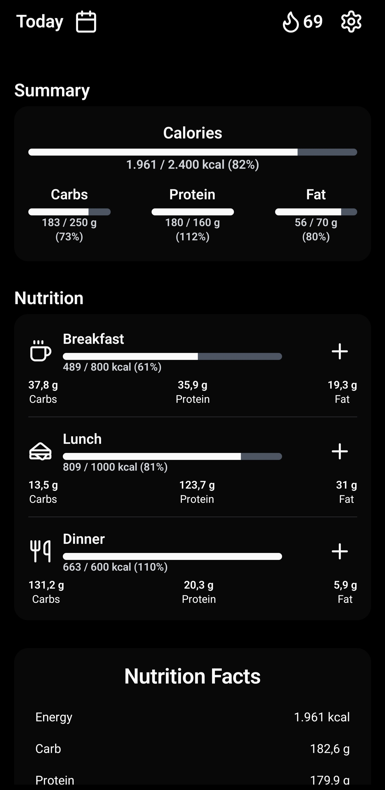
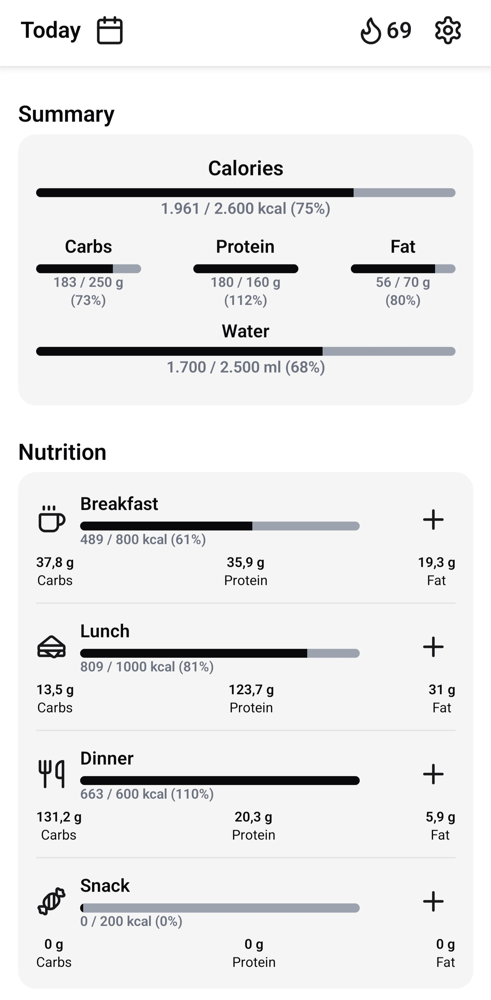
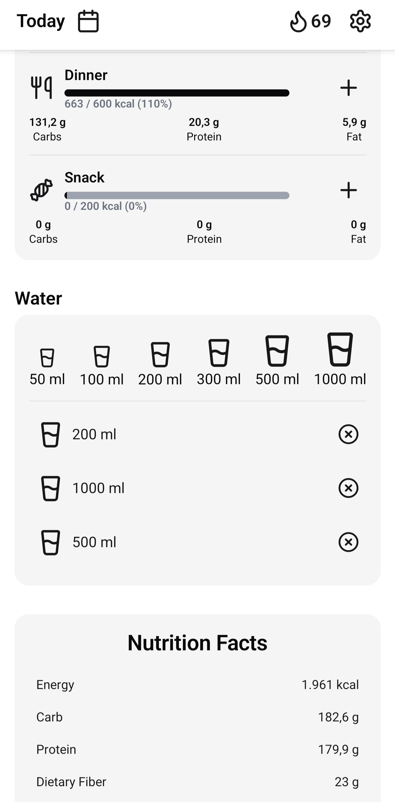
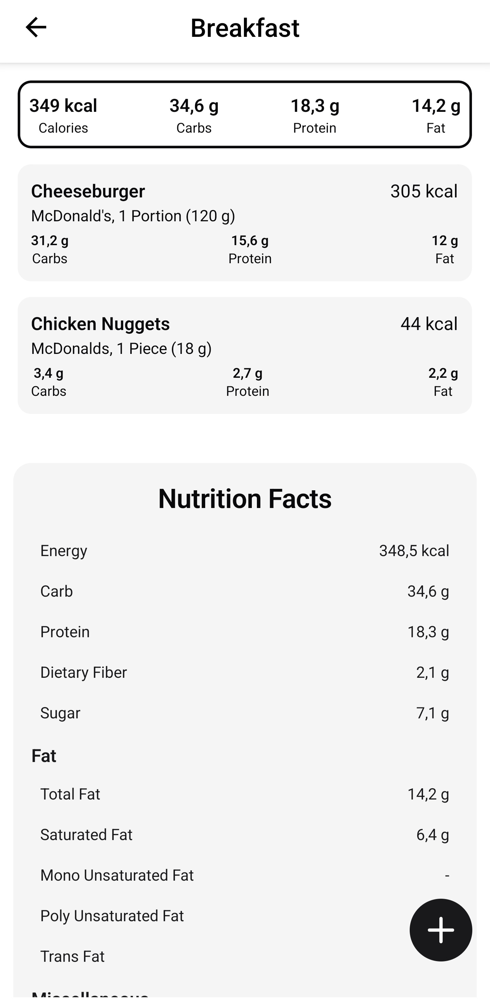
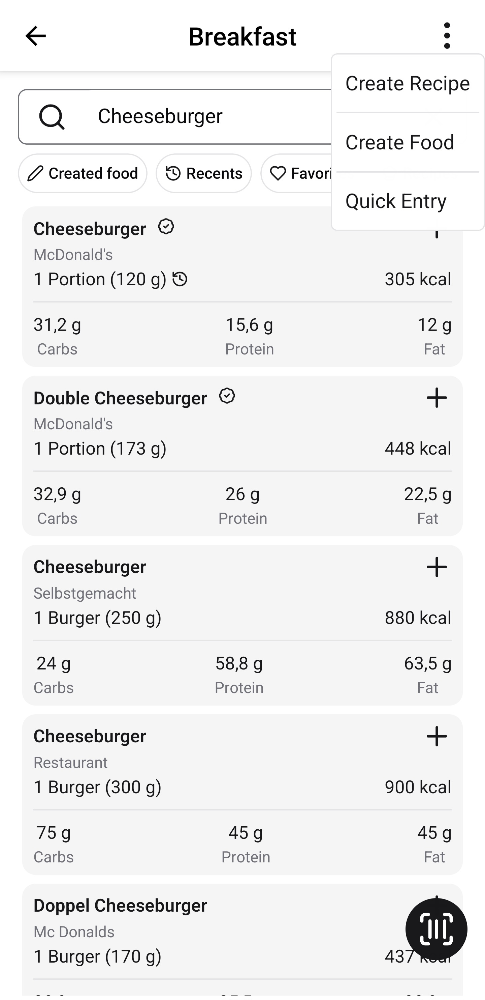
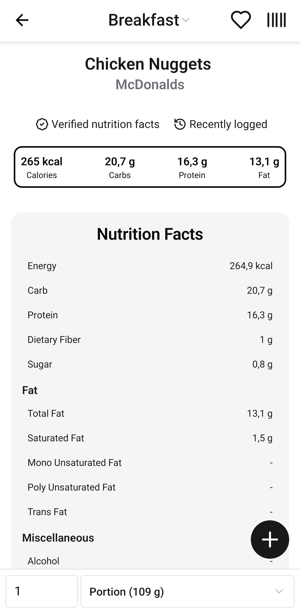
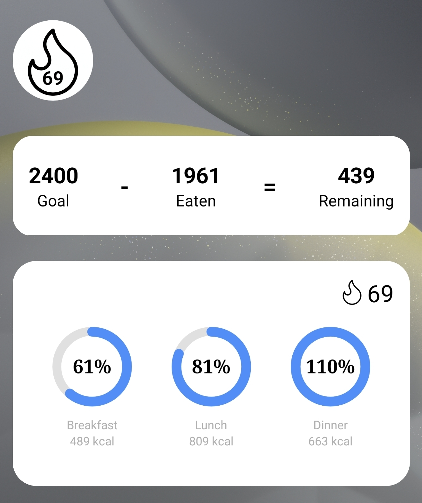

# Carbs

A more privacy‑friendly, offline‑first food tracking app built with Expo and React Native.

## Feature overview

- per meal food tracking, scanning... the usual stuff
- custom foods, quick entries and recipes
- local backup and restore of your food database
- widgets
- optional water tracking
- dark/light theme support
- better privacy: no account required, no cloud sync, only identifying data transmitted to the food API is your IP address
- completely free and open source, no bs, no ads, no tracking no unnecessary long animations (wtf yz)
- leverages the comprehensive API of a popular proprietary food tracking app
- update checker

## Get
### Android
You can download the latest APK from the [releases page](https://github.com/draqzziq/carbs/releases/latest).\
Alternatively, you can build the app yourself by following the instructions below.
### iOS
While the most of the app should work on iOS, it is not tested and there are no prebuilt binaries available.\
You are welcome to build the app yourself and experiment with it.

## Development
Code is somewhat shit but works.\
You are welcome to contribute to the project.
### Clone the repository
```bash
git clone https://github.com/draqzziq/carbs.git
cd carbs
```
### Install dependencies
```bash
yarn install
```
### Android
Make sure you have an Android emulator running or a device connected via USB with USB debugging enabled.
```bash
yarn expo run android
```

## Building
### Android
Make sure you have an Android emulator running or a device connected via USB with USB debugging enabled.
```bash
yarn expo prebuild
cd android
./gradlew assembleRelease
```

## Motivation
The existing food tracking app are either proprietary, stuffed to the brim with ads (and now useless ai features) and require an account and cloud sync or are open source but lack a solid database.\
Even if you pay for premium the experience is still bad because of unnecessary unskippable animations and similar things. (maybe you know what app I am talking about, how tf do you manage to put even more ads and annoying unskippable animations into an app that is already borderline unusable?) \
This repo is basically a custom frontend for the database of this food tracking app whose name shall not be spoken, without the bs.

## Disclaimer
This project is not affiliated with or endorsed by the owners of the proprietary food tracking app whose database it uses.\
Use at your own risk.

## Galerie
<p float="left">
  
  
  
  
  
  

  Widgets

  
</p>


## License
This project is licensed under the MIT License. See the [LICENSE](LICENSE) file for details
